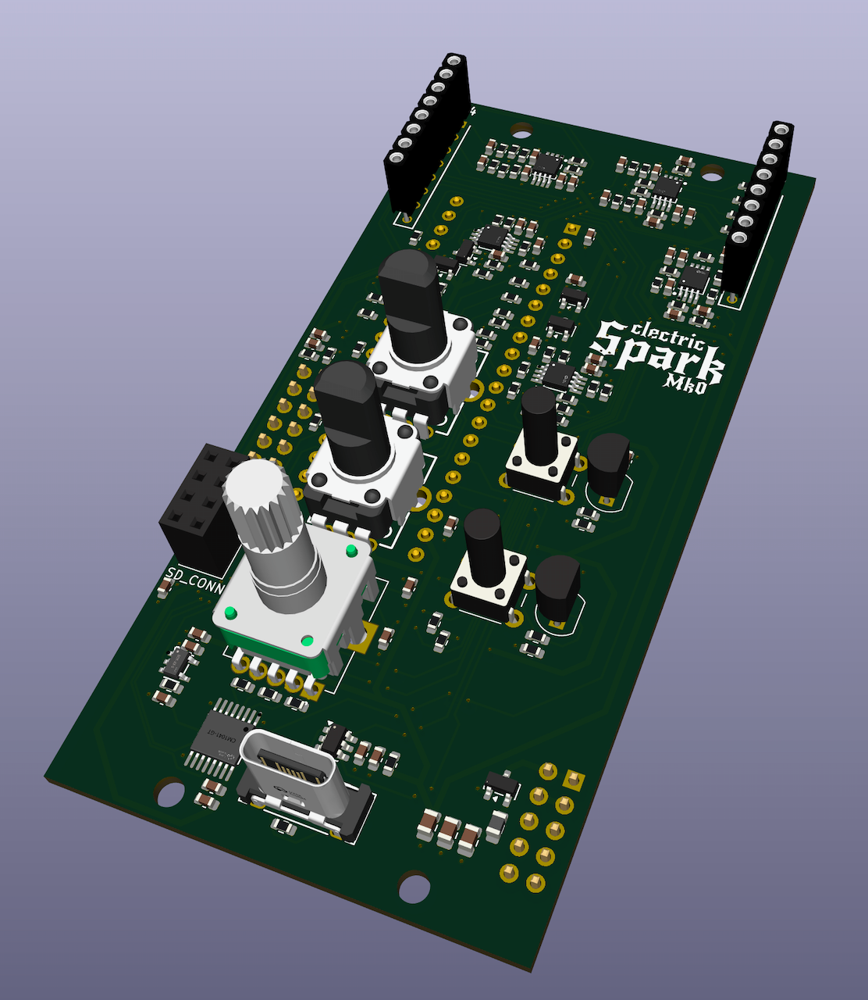

## Design Goals
- Designed for experimentation and community hacking
- Built for the [AE Modular format](https://wiki.aemodular.com/#/diy/aemodular-technical-guide.md)
- Supports firmware from the [FLUX](https://github.com/clectric-diy/FLUX) collection
- Based on the [Daisy Seed](https://daisy.audio/hardware/Seed) embedded DSP platform
- Fully compatable with firmare written for the [Daisy Pod](https://daisy.audio/product/Daisy-Pod/)
- Open hardware: schematics, PCB, and front panel files included
- Expandable with physical "Arc" modules. See below.
- ~~Vertically symetrical so that front panels can be flipped over to have an alternate design.~~ I just couldn't make it work.

## Discussions
Announcements, Q&As, and other discussions for this project should be posted to the [clectric.diy Discussions board](https://github.com/orgs/clectric-diy/discussions).

## Mk0 Protype
I (chleggett) have sent the Mk0 Prototype out for manufacturing. The vapor is starting to condense.

## Arcs
A major challenge of creating a "flash it to do anything" module is that it is difficult to expose all of the pins from the platform chip. You have to make compromises based on space, desired use, physical controls, etc. A single module simply cannot do it all.

Enter the Arc lineup. Arcs are modules that are daisy-chained from a Spark and introduce new capabilities. It may have additional I/O, faders, pots, sensors, etc.

## Collaboration
These are the canonical docs for the AE Modular version of the clectric Spark, and clone, modules.

The Repo's [wiki](https://github.com/clectric-diy/Spark-AE/wiki) should be used for community contributions. Pull Requsts of corrections and significant updates will be reviewd for addition here.

### License
This project is open hardware under the [CERN-OHL-S](https://gitlab.com/ohwr/project/cernohl/-/wikis/uploads/b236492596cfc91c12def7d50bbf7da0/cern_ohl_s_v2.pdf) license.

### Naming your Project(s)
"clectric Spark" and "clectric _anything_ Arc" are trademarked. Please do not use the words "clectric" or "electric" in the name of any of the works you create from these files.

However, you may, and are encouraged to, use "Spark" and "Arc" in your own project's name. Such as: "yourcompany Spark" or "yourcompany Fader Arc".

### Sharing your Project(s)
You are free to sell your own variations, but remember that this module is open hardware under the [CERN-OHL-S](https://gitlab.com/ohwr/project/cernohl/-/wikis/uploads/819d71bea3458f71fba6cf4fb0f2de6b/cern_ohl_s_v2.txt) license. This is a "strongly reciprocal" license, so you are required to share any changes, or an entire "combined work", as open hardware under the same license.

We have other hardware, such as [Protoboards](https://github.com/clectric-diy/Protoboards), that are licensed under the [CERN-OHL-W](https://gitlab.com/ohwr/project/cernohl/-/wikis/uploads/82b567f43ce515395f7ddbfbad7a8806/cern_ohl_w_v2.txt) "weakly reciprocal" variant. You can use those, under the terms of that variant, as components in your own projects.
